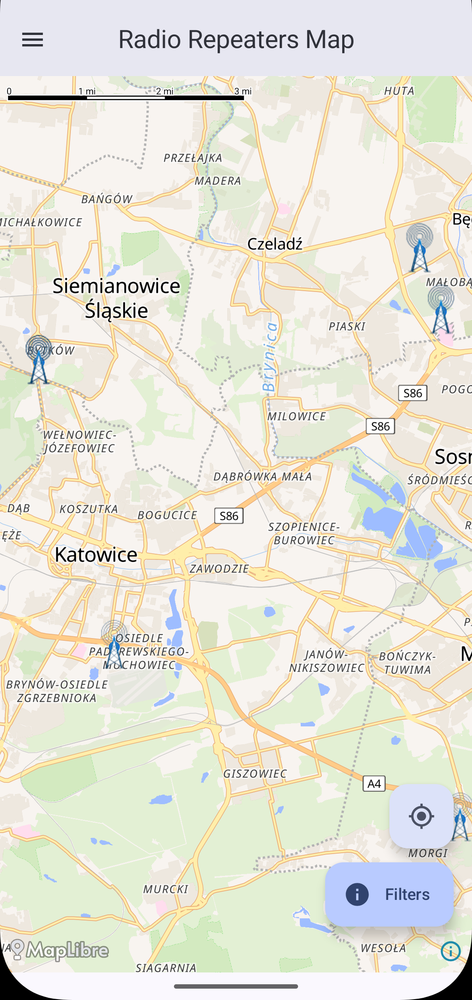
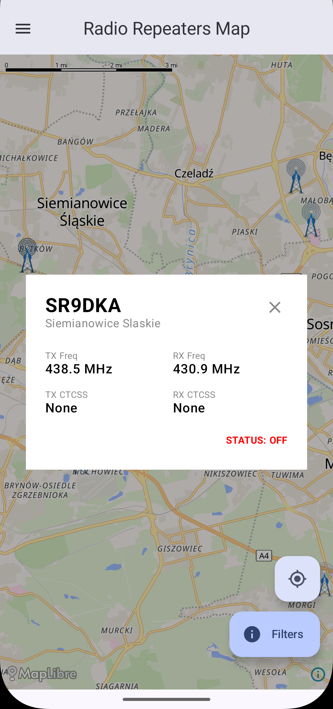
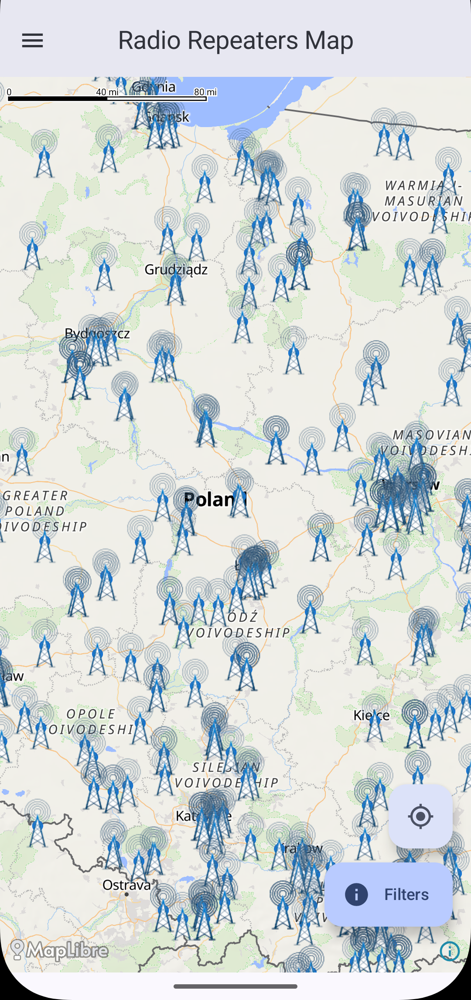
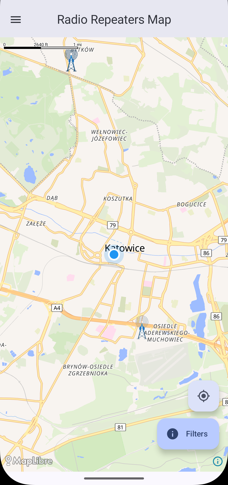
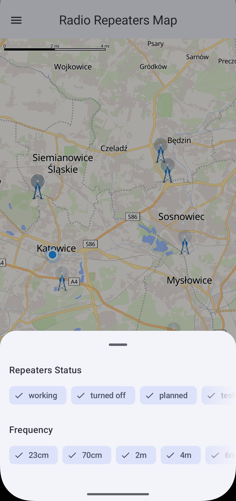
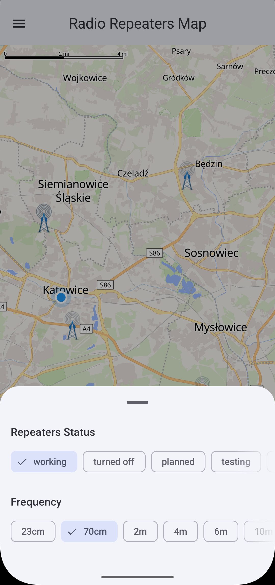

# ⚠️ EARLY WIP! ⚠️

# 🗺️ Android Radio Repeaters Map

**An interactive Android Compose map showing amateur radio repeaters**

## 📖 Overview

The Android Radio Repeaters Map is a mobile application built for Polish amateur radio enthusiasts and operators. It provides an interactive map where you can zoom around, find your local repeaters and check their details to access them.

## ✨ Features

-   🎯 **Interactive Map Display:** Visualize radio repeater locations on a dynamic and zoomable map
-   📍 **Repeater Location Markers:** Clearly marked points on the map representing each radio repeater
-   ℹ️ **Detailed Repeater Information:** Access details like RX/TX frequency, call sign, tone, and status upon clicking on repeater marker
-   🔍 **Filter Capabilities:** Filter repeaters by frequency band (23cm, 70cm, 2m, 4m, 6m, 10m) and operational status
-   📍 **GPS Localization & Real-Time Location:** Automatically center on your position with smooth camera animations and live visual location
-   📡 **Elevation & Path Loss Calculations:** Long-tap on any repeater marker to generate a Line of Sight profile and compute the Free Space Path Loss between your location and the repeater (also a Fresnel Zone visualizer, it's  not that useful but I left it be)

## 🔧 TODO
-   🌍❓ **QTH Converter:** Add a feature to convert QTH locators (e.g., `KO02MM`) to coordinates in entries where latitude and longitude are missing, so they don't end up in the middle of the ocean

## 🖥️ Screenshots

  
  
  

  
  
  

## 🤝 Credits & Acknowledgments

- **[MapLibre Compose](https://github.com/maplibre/maplibre-compose):** Open-source vector map SDK for Jetpack Compose.
- **[OpenFreeMap](https://openfreemap.org) & [OpenStreetMap](https://www.openstreetmap.org/copyright):** Map tile rendering and map data (© OpenStreetMap contributors).
- **Wojtek Jakieła SQ8W ([przemienniki.eu](https://przemienniki.eu)):** Comprehensive dataset of Polish amateur radio repeaters.
- **[Open-Meteo](https://open-meteo.com/):** Elevation data for the Line of Sight profile (provided under CC-BY 4.0).

## 📜 License

This project is licensed under the **GNU General Public License v3.0** - see the [LICENSE](LICENSE) file for details.
